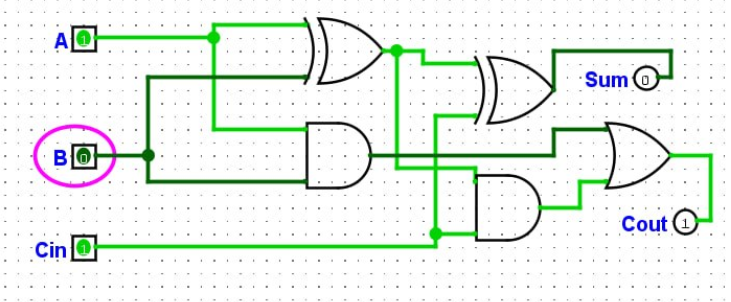

#  Домашнє завдання:

##  Завдання 1. 

**Функція:** $F = (A \land B) \lor \overline{C}$

Для 3 змінних ($A, B, C$) кількість рядків дорівнює $2^3 = 8$.

### Таблиця істинності:

| A | B | C | $A \land B$ | $\overline{C}$ | $F = (A \land B) \lor \overline{C}$ |
|:-:|:-:|:-:|:-----------:|:--------------:|:----------------------------------:|
| 0 | 0 | 0 |      0      |       1        |               **1**                |
| 0 | 0 | 1 |      0      |       0        |               **0**                |
| 0 | 1 | 0 |      0      |       1        |               **1**                |
| 0 | 1 | 1 |      0      |       0        |               **0**                |
| 1 | 0 | 0 |      0      |       1        |               **1**                |
| 1 | 0 | 1 |      0      |       0        |               **0**                |
| 1 | 1 | 0 |      1      |       1        |               **1**                |
| 1 | 1 | 1 |      1      |       0        |               **1**                |

##  Завдання 2. 

**Початковий вираз:** $\overline{A \lor B} \land (A \lor B)$

### Покрокове спрощення:
1. Застосовуємо **закон де Моргана** до першої частини:
   $$\overline{A \lor B} = \overline{A} \land \overline{B}$$

2. Підставляємо в початковий вираз:
   $$(\overline{A} \land \overline{B}) \land (A \lor B)$$

3. Застосовуємо **закон протиріччя**. Позначивши $X = (A \lor B)$, вираз набуває вигляду:
   $$\overline{X} \land X = 0$$

**Висновок:** Результат виразу **завжди дорівнює 0** для будь-яких значень $A$ та $B$, оскільки це є логічним протиріччям (вимога, щоб вираз був одночасно істинним та хибним).

## Завдання 3. 

### Логічні формули повного суматора:
- **Сума ($Sum$):** $Sum = A \oplus B \oplus C_{in}$
- **Перенос ($C_{out}$):** $C_{out} = (A \land B) \lor (C_{in} \land (A \oplus B))$

### Вентилі, що використовуються:
1. **Вихід $Sum$:**
   - Реалізується **2 вентилями XOR** (Виключне АБО).
2. **Вихід $C_{out}$:**
   - Реалізується **2 вентилями AND** (І) та **1 вентилем OR** (АБО).

### Структурна схема:

