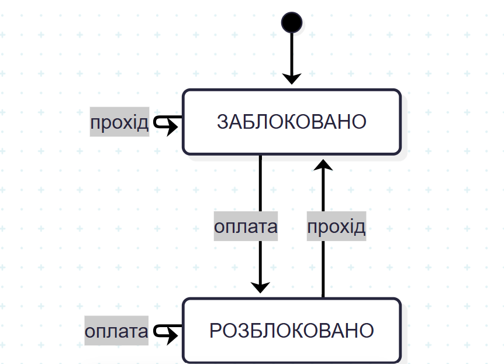

#  Домашнє завдання:

##  Контрольні запитання

1. **У чому полягає принципова різниця між комбінаційною і послідовнісною схемою?**
   Комбінаційна схема не має пам'яті, тому її вихід залежить лише від поточних входів. Послідовнісна схема містить елементи пам'яті (тригери), тому її вихід залежить і від поточних входів, і від попереднього стану.

2. **Чому JK-тригер вважають універсальнішим за RS-тригер?**
   У RS-тригері комбінація $S=1, R=1$ є забороненою і викликає невизначеність. JK-тригер усуває це обмеження: при $J=1, K=1$ він переходить у режим перемикання (toggle), змінюючи стан на протилежний.

3. **Яка різниця між синхронізацією за рівнем і за фронтом?**
   При синхронізації за рівнем тригер реагує на вхідні дані протягом усього часу, поки тактовий сигнал залишається активним. При синхронізації за фронтом тригер запам'ятовує значення лише в короткий момент переходу тактового сигналу з 0 в 1 або з 1 в 0.

4. **Чим відрізняється паралельний регістр від зсувного?**
   Паралельний регістр приймає та видає всі біти даних одночасно за один такт по окремих лініях. Зсувний регістр передає дані послідовно по одному біту за такт, зсуваючи їх ланцюжком через тригери.

5. **У чому головна відмінність автомата Мілі від автомата Мура?**
   У виході: в автоматі Мура вихідний сигнал залежить виключно від поточного стану системи. В автоматі Мілі вихідний сигнал залежить як від поточного стану, так і від поточних вхідних сигналів.

6. **Наведіть приклад використання скінченного автомата в задачах розробки ПЗ.**
   Скінченні автомати використовуються в синтаксичних аналізаторах (парсерах) мов програмування, для управління станами мережевих протоколів (наприклад, TCP) та для моделювання станів користувацького інтерфейсу (завантаження, успіх, помилка).

7. **Скільки тактів потрібно, щоб записати 4-бітне слово у паралельний регістр, а скільки - у зсувний, і чому?**
   У паралельний регістр потрібно 1 такт, оскільки всі біти записуються в свої тригери одночасно. У зсувний регістр потрібно 4 такти, бо дані заходять послідовно по одному біту за кожен такт.

8. **Чому 3-бітний лічильник з довільним модулем М=6 потребує додаткової комбінаційної логіки, а не лише самих тригерів?**
   Природна межа 3-бітного лічильника дорівнює 8 станам (від 0 до 7). Щоб примусово обнулити його після стану 5 (для отримання 6 станів), потрібна комбінаційна схема, яка виявить цей стан і подасть сигнал скидання.

9. **За таблицею переходів автомата кодового замка визначте, у якому стані опиниться автомат після послідовності входів A, A, B, і поясніть свій хід кроками.**
   Почавши зі стану S0, перший вхід A переведе автомат у стан S1, другий вхід A є помилковим і скине його назад у S0, а вхід B залишить автомат у S0. У результаті автомат опиниться у початковому заблокованому стані S0.

##  Домашнє завдання

### Завдання 1. 

Таблиця переходів показує наступний стан $Q(t+1)$ залежно від вхідних сигналів $J$ та $K$:

| $J$ | $K$ | Наступний стан $Q(t+1)$ | Опис / Пояснення |
|:---:|:---:|:----------------------:|:-----------------|
| 0 | 0 | $Q(t)$ | **Збереження стану** (вихід не змінюється) |
| 0 | 1 | 0 | **Скидання (Reset)** (вихід стає 0) |
| 1 | 0 | 1 | **Встановлення (Set)** (вихід стає 1) |
| 1 | 1 | $\overline{Q(t)}$ | **Перемикання (Toggle)** (вихід інвертується) |

**Чому універсальний:**
У RS-тригері комбінація $S=1, R=1$ є забороненою, а в JK-тригері $J=1, K=1$ працює як режим перемикання (Toggle). Окрім цього, JK-тригер може виконувати функції D-тригера та T-тригера при відповідній комутації входів.

### Завдання 2. 

### Завдання 3. 
4-бітний паралельний регістр будується на чотирьох окремих D-тригерах, інформаційні входи D яких приймають окремі біти слова, а всі синхровходи CLK об'єднані в одну спільну тактову лінію, завдяки чому при надходженні єдиного фронту тактового сигналу всі 4 біти (наприклад, 1011) одночасно записуються та фіксуються на виходах Q0...Q3 за 1 такт, на відміну від зсувного регістру, який приймає дані поодинці і вимагає 4 такти для повного запису того самого слова.