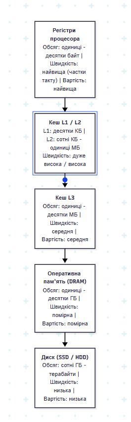

# Домашня робота:

##  Контрольні запитання

1. **Чому ієрархія пам'яті побудована саме за принципом «менше, але швидше» ближче до процесора?**
   Надшвидка пам'ять коштує дуже дорого й займає багато місця на кристалі, тому біля процесора ставлять її маленький обсяг для швидкого доступу, а основний обсяг роблять із дешевших і повільніших технологій[cite: 24].

2. **У чому різниця між часовою і просторовою локальністю? Наведіть по одному прикладу коду.**
   Часова локальність означає, що недавно використані дані знадобляться знову (наприклад, змінна-лічильник у циклі `for`), а просторова — що поруч розташовані дані знадобляться наступними (наприклад, послідовне читання елементів масиву)[cite: 25].

3. **Порівняйте пряме, повністю асоціативне і множинно-асоціативне відображення кешу.**
   При прямому відображенні блок пам'яті має лише одне чітке місце в кеші, при повністю асоціативному — може лягти в будь-яку вільну комірку, а при множинно-асоціативному — у будь-яку комірку всередині своєї групи (множини)[cite: 25].

4. **Чим відрізняється обов'язковий, ємнісний і конфліктний промахи кешу?**
   Обов'язковий промах виникає при найпершому зверненні до даних, ємнісний — коли весь кеш заповнений і не вміщує програму, а конфліктний — коли декілька блоків змагаються за одну й ту саму комірку при прямому або множинному відображенні[cite: 26].

5. **У чому різниця між наскрізним і зворотним записом у кеш?**
   При наскрізному записі дані одночасно зберігаються і в кеш, і в оперативку, а при зворотному — записуються тільки в кеш, і потрапляють в оперативку лише тоді, коли цей рядок витісняється[cite: 26].

6. **Що таке сторінковий промах і чим він небезпечний для продуктивності програми?**
   Це ситуація, коли потрібної сторінки немає в оперативці і її доводиться завантажувати з диска, що сповільнює роботу процесора в тисячі разів через повільність SSD/HDD[cite: 26].

7. **Чому графік залежності часу доступу від розміру масиву має східчастий вигляд, і чому вісь розміру будують у логарифмічному масштабі?**
   Графік має сходинки через різкі стрибки часу при переході між рівнями L1, L2, L3 та DRAM, а логарифмічний масштаб використовують, щоб на одному малюнку помістити і кілобайти, і десятки мегабайтів[cite: 24, 25].

8. **Як обчислити кількість бітів VPN і offset для заданої розрядності адреси й розміру сторінки? Наведіть формулу.**
   Кількість бітів зміщення рахується як $offset\_bits = \log_2(\text{розмір\_сторінки})$, а біти номера сторінки — як $vpn\_bits = \text{розрядність\_адреси} - offset\_bits$[cite: 26].

9. **Чим TLB-промах відрізняється від сторінкового промаху (page fault) і чому перше звернення до сторінки завжди дає TLB-промах?**
   TLB-промах означає лише те, що адреси немає у швидкому буфері трансляції (але сама сторінка є в оперативці), а при першому зверненні запису в TLB фізично ще не існує, тому буфер завжди дає промах[cite: 26, 27, 29].

##  Домашнє завдання

### Завдання 1. 

### Завдання 2. Порівняння обходу масиву int a[100][100] по рядках та по стовпцях
Обхід двовимірного масиву по рядках дає значно менше промахів кешу й працює набагато швидше, ніж обхід по стовпцях, оскільки в мові C елементи масиву розташовуються в пам'яті послідовно рядок за рядком, завдяки чому при читанні першого елемента кеш завантажує цілий рядок (кеш-лінію) із сусідніми елементами, максимально ефективно використовуючи просторову локальність.   
### Завдання 3. Робота кешу за стратегією write-back та "брудний" (dirty) рядок
Коли рядок кешу позначений як «брудний» (dirty bit = 1), це означає, що дані в кеші були змінені процесором, але ще не записані в оперативну пам'ять; при витісненні такого рядка кеш спочатку перезаписує нові дані в оперативку й лише потім завантажує нові, тоді як при стратегії write-through запис в оперативку відбувається миттєво при кожній зміні, тому «брудних» рядків не існує і витіснення відбувається без додаткової затримки на збереження. 