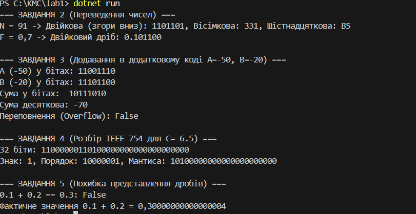

# Варіант 3
## Дані
 N = 91 (ціле число)
 F = 0.7 (дріб)
 A = -50, B = -20 (числа для додавання)
 C = -6.5 (число у форматі IEEE 754)

## Крок 1. Ручні розрахунки 

# 1. Переведення цілого числа N = 91

## У двійкову систему 
 91 \ 2 = 45 (остача 1)
 45 \ 2 = 22 (остача 1)
 22 \ 2 = 11 (остача 0)
 11 \ 2 = 5 (остача 1)
 5 \ 2 = 2 (остача 1)
 2 \ 2 = 1 (остача 0)
 1 \ 2 = 0 (остача 1)
Результат : 1101101

# У вісімкову систему 
91 \ 8 = 11 (остача 3)
11 \ 8 = 1 (остача 3)
1 \ 8 = 0 (остача 1)
Результат: 331

# У шістнадцяткову систему
91 \ 16 = 5 (остача 11 - позначається як B)
5 \ 16 = 0 (остача 5)
Результат: B5

# 2. Переведення дробу F = 0.7 у двійкову систему 

0.7 \ 2 = 1.4 (ціла частина 1, залишок 0.4)
0.4 \ 2 = 0.8 (ціла частина 0)
0.8 \ 2 = 1.6 (ціла частина 1, залишок 0.6)
0.6 \ 2 = 1.2 (ціла частина 1, залишок 0.2)
0.2 \ 2 = 0.4 (ціла частина 0)
0.4 \ 2 = 0.8 (ціла частина 0)(воно повторює 2 період)
# Результа: 101100

# Крок 3
Сума у бітах: 10111010
Десяткове: -70
Переповнення: False

# Крок 4
32 біти: 11000000110100000000000000000000
Знак: 1
Порядок: 10000001 
Мантиса: 10100000000000000000000
Відновлене значення: -6.5

Крок 5
0.1 + 0.2 == 0.3: False
Фактична сума 0.1 + 0.2 = 0.30000000000000004

#Відповідь кода:

