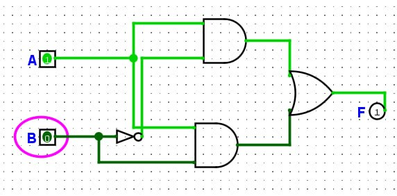
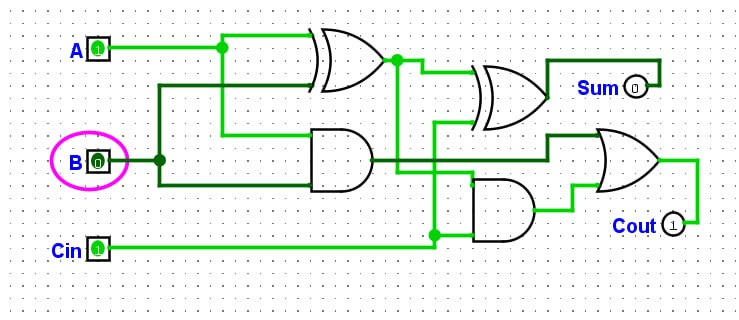
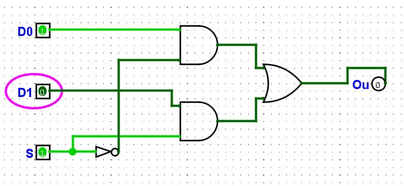

# ЗВІТ З ПРАКТИЧНОЇ РОБОТИ №2

**Тема:** Синтез комбінаційних схем
**Інструмент:** Logisim Evolution 
**Варіант:** №3 

**Мета:** Навчитися будувати і перевіряти таблицею істинності базові комбінаційні вузли (півсуматор, повний суматор, мультиплексор) і синтезувати схему за заданою логічною функцією двох змінних.

## Хід роботи

### 1. Встановлення середовища Logisim Evolution
Установили та запустили середовище **Logisim Evolution**. Створили новий проєкт для побудови комбінаційних схем із використанням бібліотек **Gates** та **Input/Output**

### 2. Дослідження та побудова півсуматора (Half Adder)
Зібрали схему півсуматора з вентилів **XOR** (обчислення суми $Sum = A \oplus B$) та **AND** (обчислення переносу $Carry = A \land B$).

#### Таблиця істинності півсуматора[cite: 1]:
| Вхід A | Вхід B | Вихід Sum ($A \oplus B$) | Вихід Carry ($A \land B$) |
| :---: | :---: | :---: | :---: |
| 0 | 0 | 0 | 0 |
| 0 | 1 | 1 | 0 |
| 1 | 0 | 1 | 0 |
| 1 | 1 | 0 | 1 |

### 3. Дослідження та побудова повного суматора (Full Adder)
Зібрали схему повного суматора з двох півсуматорів (вентилі **XOR** та **AND**) і одного вентиля **OR** для об'єднання переносових сигналів.

#### Таблиця істинності повного суматора[cite: 2]:
| Вхід A | Вхід B | Вхід $C_{in}$ | Вихід Sum | Вихід $C_{out}$ |
| :---: | :---: | :---: | :---: | :---: |
| 0 | 0 | 0 | 0 | 0 |
| 0 | 0 | 1 | 1 | 0 |
| 0 | 1 | 0 | 1 | 0 |
| 0 | 1 | 1 | 0 | 1 |
| 1 | 0 | 0 | 1 | 0 |
| 1 | 0 | 1 | 0 | 1 |
| 1 | 1 | 0 | 0 | 1 |
| 1 | 1 | 1 | 1 | 1 |

### 4. Дослідження та побудова мультиплексора 2-в-1
Зібрали схему мультиплексора 2-в-1 на базових елементах **NOT**, **AND** та **OR** без використання готового компонента з бібліотеки **Plexers**[cite: 3].  
**Логічна функція:** $Out = (D_0 \land \overline{S}) \lor (D_1 \land S)$[cite: 3].

#### Таблиця істинності мультиплексора 2-в-1[cite: 3]:
| $S$ | $D_0$ | $D_1$ | Вихід $Out$ |
| :---: | :---: | :---: | :---: |
| 0 | 0 | X | 0 |
| 0 | 1 | X | 1 |
| 1 | X | 0 | 0 |
| 1 | X | 1 | 1 |

*(Примітка: X — значення сигналу не впливає на вихід)*

### 5. Синтез комбінаційної схеми за Варіантом №3
Згідно з умовами варіанта №3, функція задана наборами $F = 1$ для наборів №2 ($10_2$) та №3 ($11_2$).

#### Таблиця істинності функції (Варіант №3):
| № набору | Вхід A | Вхід B | Вихід F |
| :---: | :---: | :---: | :---: |
| 0 | 0 | 0 | 0 |
| 1 | 0 | 1 | 0 |
| 2 | 1 | 0 | 1 |
| 3 | 1 | 1 | 1 |

#### Запис ДДНФ (Досконалої Диз'юнктивної Нормальної Форми):
ДДНФ записується як сума кон'юнкцій для рядків, де $F = 1$:
$$F = (A \land \overline{B}) \lor (A \land B)$$

#### Алгебраїчна мінімізація:
$$F = A \land (\overline{B} \lor B) = A \land 1 = A$$

#### Опис зібраної схеми:
Схему реалізовано строго за канонічною ДДНФ: за допомогою двох вентилів **AND** (для формування продуктів $A \land \overline{B}$ та $A \land B$), одного елемента **NOT** (для інверсії $B$) та одного елемента **OR** (для їх об'єднання). Симуляція у Logisim підтвердила повну відповідність функціонування таблиці істинності.

## Висновки
Під час виконання практичної роботи опановано роботу в середовищі комп'ютерного моделювання Logisim Evolution. Було успішно побудовано та перевірено за допомогою таблиць істинності базові комбінаційні цифрові вузли: півсуматор, повний суматор та мультиплексор 2-в-1 на базових вентилях **NOT**, **AND**, **OR**. За завданням індивідуального Варіанта №3 побудовано таблицю істинності, складено канонічну ДДНФ, збірна логічну схему та підтверджено її правильність у симуляторі.