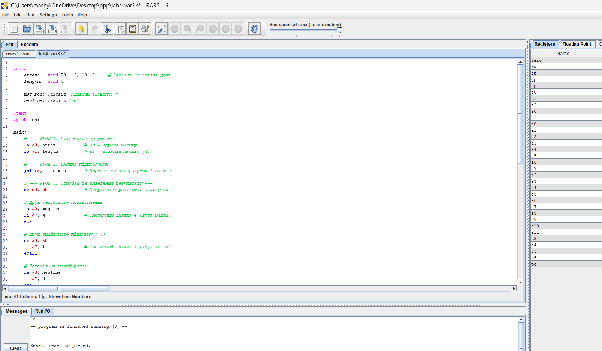
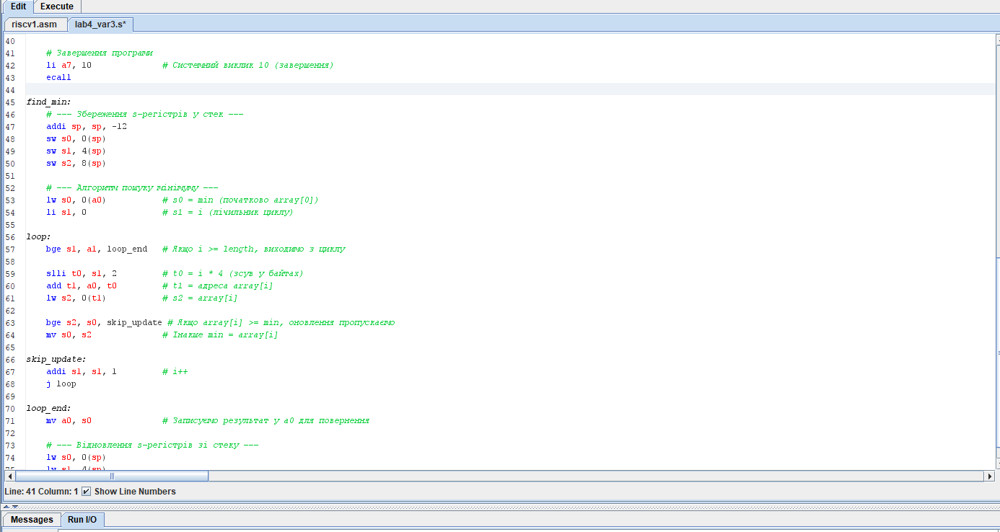
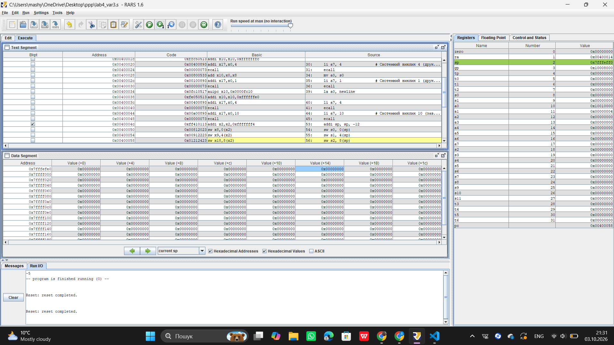

# Звіт з практичної роботи №4
**Варіант:** №3  

## 1. Мета роботи
Освоїти написання, асемблювання і покрокове відлагодження програми мовою асемблера RISC-V у середовищі RARS: цикл обробки масиву, умовний перехід і виклик підпрограми з дотриманням конвенції передачі параметрів.

## 2. Індивідуальне завдання (Варіант 3)
* **Завдання:** Пошук мінімуму серед елементів масиву.
* **Тестовий масив:** `20, -5, 13, 6`
* **Очікуваний результат:** `-5`

## 3. Код програми (`lab4_var3.s`)

## 4. Ручний розрахунок

* **Вхідні дані:** `array = [20, -5, 13, 6]`, `length = 4`
* **Крок 0 ($i=0$):** `min = 20`.
* **Крок 1 ($i=1$):** `array[1] = -5`. Оскільки $-5 < 20$, `min` оновлюється на **`-5`**.
* **Крок 2 ($i=2$):** `array[2] = 13`. Оскільки $13 \ge -5$, оновлення немає. `min = -5`.
* **Крок 3 ($i=3$):** `array[3] = 6`. Оскільки $6 \ge -5$, оновлення немає. `min = -5`.
* **Крок 4 ($i=4$):** $i \ge 4 \rightarrow$ кінець циклу.
* **Результат:** `-5`.

## 5. Результати виконання та покрокове відлагодження

### 5.1. Результат роботи програми (Консоль RARS)

Програма коректно обробила тестовий масив і вивела очікуваний мінімум `-5`.

### 5.2. Покрокове виконання (Крок 5)

Для відлагодження було встановлено Breakpoint на першу інструкцію підпрограми `find_min` (`addi sp, sp, -12`). За допомогою кнопки **Step** здійснено три послідовні кроки виконання інструкцій:

**Аналіз стану регістрів на кроках:**

* **`a0`** = `0x10010000` (адреса початку масиву в пам'яті).
* **`a1`** = `4` (розмір масиву).
* **`sp`** = `0x7fffeff0` (зсунуто на -12 байт для збереження s-регістрів).

## 6. Висновок щодо ролі `ra` та `s`-регістрів

1. **Регістр `ra` (Return Address):** Зберігає адресу інструкції, до якої потрібно повернутися після завершення підпрограми. Вона автоматично записується інструкцією `jal` і використовується командами `ret` / `jr ra`.
2. **`s`-регістри (`s0-s11`):** Згідно з конвенцією виклику RISC-V, вони вважаються збереженими регістрами (*callee-saved*). Підпрограма зобов’язана зберегти їхні оригінальні значення у стек перед використанням і відновити їх перед поверненням (`ret`), щоб не порушити роботу основної програми.

### Контрольні запитання:
1. **Чому `x0` завжди 0 і навіщо він потрібен?**
   Він залізно дорівнює нулю в самому процесорі. Це зроблено, щоб не вигадувати купу зайвих команд. Наприклад, щоб скопіювати значення з одного регістра в інший, процесор просто додає до нього `x0` (`add a0, s0, x0`), або щоб зробити порожній крок (`nop`), додає 0 до 0.

2. **Яка різниця між `li` і `la`?**
   * `li` (*Load Immediate*) — завантажує в регістр **просте число** (наприклад, `li a7, 1` — завантажили число 1).
   * `la` (*Load Address*) — завантажує **адресу в пам'яті**, де лежить текст або масив (наприклад, `la a0, array`).

3. **Як зробити цикл лише через `beq`, `bne`, `blt`, `bge`, `j`?**
   Ставимо лічильник `i = 0`. На початку циклу робимо перевірку через `bge` (якщо `i >= довжина`, то виходимо). В кінці циклу додаємо `i++` і робимо стрибок назад на початок через `j`.

4. **Що робить `jal` і чому з ним проблема при вкладених викликах?**
   `jal` робить стрибок у підпрограму і записує в регістр `ra` точку повернення (куди вертатися). Якщо одна підпрограма викликає іншу, новий `jal` затре стару адресу в `ra`, і програма "заблукає". Тому `ra` треба ховати в стек.

5. **Як передаються аргументи і чим `s`-регістри відрізняються від інших?**
   Аргументи кидають у `a0-a7`, а результат забирають з `a0`. **`s`-регістри** — це "особисті" регістри головної програми. Якщо підпрограма хоче їх юзати, вона повинна спочатку зберегти їхні значення в стек, а перед виходом — повернути як було.

6. **Які номери `a7` ми використали і що буде, якщо забути `a0` перед `ecall`?**
   Використали: `a7 = 1` (друк числа), `a7 = 4` (друк тексту), `a7 = 10` (вихід з програми). Якщо забути записати значення в `a0` перед `ecall`, програма виведе те рандомне сміття, яке випадково лежало в `a0` до цього.
