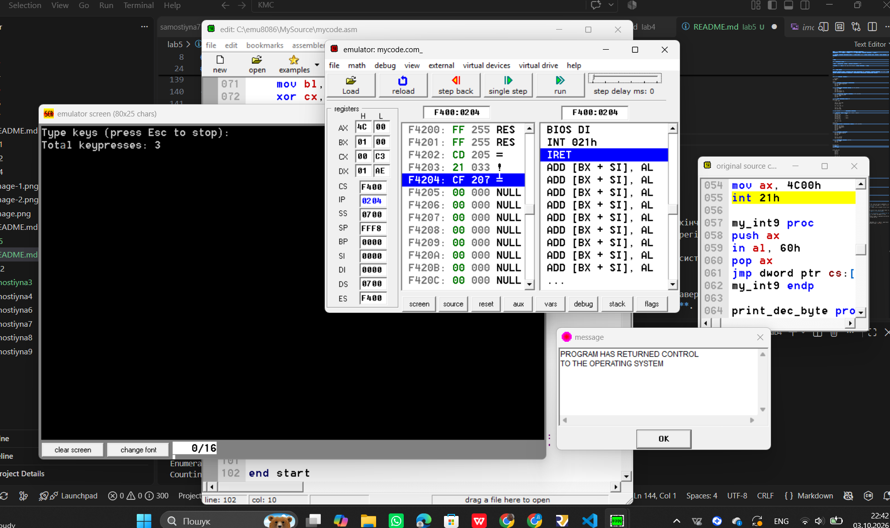

# ЗВІТ
### з практичної роботи №5
**Тема:** Переривання, таймер і введення-виведення на х86
**Варіант №3:** Стоп по Esc , всього натискань до нього


### 1. Мета роботи

Навчитися виводити текст і зчитувати ввід через переривання DOS, працювати з портами командами `in`/`out`, а також встановити власний обробник переривання клавіатури з обов'язковим відновленням оригінального вектора.


### 2. Код програми (Варіант 3)

```assembly
 .model tiny
.code
org 100h

start:
    mov ah, 09h
    lea dx, msg_start
    int 21h

    mov ax, 3509h
    int 21h
    mov word ptr cs:[old_int9], bx
    mov word ptr cs:[old_int9+2], es

    cli
    mov ax, 2509h
    lea dx, my_int9
    int 21h
    sti

key_loop:
    mov ah, 00h
    int 16h

    cmp ah, 01h
    je stop_loop
    cmp al, 1Bh
    je stop_loop

    inc cs:[key_count]

    mov dl, al
    mov ah, 02h
    int 21h
    jmp key_loop

stop_loop:
    cli
    mov ax, 2509h
    lds dx, cs:[old_int9]
    int 21h
    sti

    push cs
    pop ds

    mov ah, 09h
    lea dx, msg_res
    int 21h

    mov al, cs:[key_count]
    call print_dec_byte

    mov ax, 4C00h
    int 21h

my_int9 proc
    push ax
    in al, 60h
    pop ax
    jmp dword ptr cs:[old_int9]
my_int9 endp

print_dec_byte proc
    push ax
    push bx
    push cx
    push dx

    xor ah, ah
    mov bl, 10
    xor cx, cx

dec_loop:
    div bl
    push ax
    inc cx
    xor ah, ah
    cmp al, 0
    jne dec_loop

print_digits:
    pop ax
    mov dl, ah
    add dl, '0'
    mov ah, 02h
    int 21h
    loop print_digits

    pop dx
    pop cx
    pop bx
    pop ax
    ret
print_dec_byte endp

old_int9  dd 0
key_count db 0
msg_start db 'Type keys (press Esc to stop): $'
msg_res   db 0Dh, 0Ah, 'Total keypresses: $'

end start

```


### 3. Результат виконання програми




### 4. Відповіді на контрольні запитання

1. **Чим відрізняються `ah=09h` i `ah=02h` для виводу тексту?**
* **`ah=09h`** використовується для виводу **цілого рядка** символів з пам'яті, який обов'язково закінчується символом `$`.
* **`ah=02h`** використовується для виводу **одного поодинокого символу**, код якого передається в регістрі `DL`.
2. **Навіщо зберігати адресу оригінального обробника перед встановленням нового?**
* Адресу зберігають через `ah=35h`, щоб під час роботи передавати керування стандартному обробнику системи та обов'язково **відновити її перед завершенням програми**.
3. **Що станеться, якщо не відновити вектор `int 9h`?**
* Якщо вектор не відновити через `ah=25h`, у таблиці векторів залишиться адреса програми, яка вже завершилася та вивантажилася з пам'яті. При наступному натисканні будь-якої клавіші система **зависне або впаде у критичну помилку**.
4. **Чим `in`/`out` відрізняються від переривань BIOS/DOS?**
* Команди **`in` / `out**` працюють **безпосередньо з апаратними портами** контролера пристрою на найнижчому рівні.
* **Переривання BIOS/DOS** — це високорівневі програмні функції-посередники, які надає операційна система.
5. **Яку роль відіграють `cli` і `sti` під час зміни вектора переривання?**
* Команда **`cli`** тимчасово вимикає апаратні переривання, а **`sti`** вмикає їх назад. Це захищає процес перезапису адреси вектора від випадкового спрацьовування переривання на "напівзмінену" (некоректну) адресу.


### 5. Висновок

Під час виконання практичної роботи було опановано роботу з перериваннями DOS/BIOS, прямою вибіркою даних із порту клавіатури `60h` та механізмом перехоплення й коректного відновлення векторів апаратних переривань (`int 9h`).