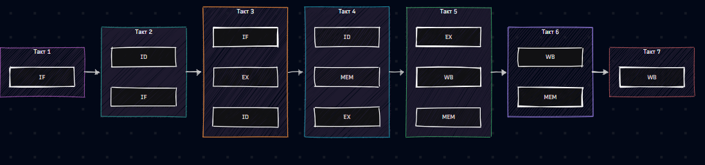
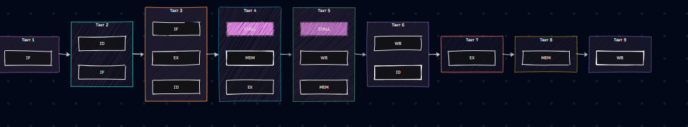

# Звіт з самостійної роботи №4

**Тема:** Мікропрограмне керування і конвеєр команд   
**Варіант:** 3 
**Послідовність команд:**  
1. `ADD R1, R2, R3`
2. `ADD R4, R5, R6`
3. `SUB R7, R1, R4`

---

## 1. Часова діаграма ідеального конвеєра (без урахування конфліктів)

У разі ідеальної роботи 5-стадійного конвеєра (`IF`, `ID`, `EX`, `MEM`, `WB`) кожна наступна команда починається на 1 такт пізніше за попередню.

| Команда \ Такт | 1 | 2 | 3 | 4 | 5 | 6 | 7 |
| :--- | :---: | :---: | :---: | :---: | :---: | :---: | :---: |
| **1. ADD R1, R2, R3** | IF | ID | EX | MEM | WB | — | — |
| **2. ADD R4, R5, R6** | — | IF | ID | EX | MEM | WB | — |
| **3. SUB R7, R1, R4** | — | — | IF | ID | EX | MEM | WB |

## 2. Визначення конфлікту за даними (Data Hazard)

* **Конфліктна пара:** Команда №3 (`SUB R7, R1, R4`) залежить від результатів обох попередніх команд — №1 (`ADD R1, R2, R3`) та №2 (`ADD R4, R5, R6`).
* **Детальний аналіз конфлікту:**
  * Команда №1 записує результат у регістр **`R1`** на своїй стадії `WB` (такт 5).
  * Команда №2 записує результат у регістр **`R4`** на своїй стадії `WB` (такт 6).
  * Команда №3 на стадії `ID` (такт 4) намагається зчитати регістри **`R1`** та **`R4`**.
  * **Проблема:** На такті 4 ні `R1`, ні `R4` ще не оновлені у регістровому файлі (команда №1 віддасть `R1` лише на такті 5, а команда №2 віддасть `R4` лише на такті 6). Це конфлікт типу **RAW (Read-After-Write)** з залежністю через один крок від другої команди.

## 3. Скоригована діаграма зі вставленими простоями (Stalls)

Щоб усунути конфлікт за даними без застосування пересилання (`forwarding`), стадію декодування (`ID`) для третьої команди затримують простоями (`STALL`). Вона чекає, поки команда №2 не виконає запис у `R4` на стадії `WB` (такт 6).

| Команда \ Такт | 1 | 2 | 3 | 4 | 5 | 6 | 7 | 8 | 9 |
| :--- | :---: | :---: | :---: | :---: | :---: | :---: | :---: | :---: | :---: |
| **1. ADD R1, R2, R3** | IF | ID | EX | MEM | WB | — | — | — | — |
| **2. ADD R4, R5, R6** | — | IF | ID | EX | MEM | WB | — | — | — |
| **3. SUB R7, R1, R4** | — | — | IF | **STALL** | **STALL** | ID | EX | MEM | WB |

*Пояснення затримок:*
* **Такт 4:** Команда №3 чекає (`STALL`), бо `R1` оновиться тільки в кінці такту 5, а `R4` — в кінці такту 6.
* **Такт 5:** Другий `STALL` для очікування запису `R4` командою №2.
* **Такт 6:** На стадії `ID` команда №3 успішно зчитує вже готові значення з `R1` та `R4`.

## 4. Розрахунок загальної кількості тактів

Обчислимо час виконання послідовності з 3 команд ($N = 3$) трьома способами:

1. **Без конвеєра:**
   $$\text{Такті} = N \times 5 = 3 \times 5 = \mathbf{15\text{ тактів}}$$
   *(Кожна команда послідовно виконує всі 5 стадій одна за одною)*.

2. **З ідеальним конвеєром (без затримок):**
   $$\text{Такті} = 5 + N - 1 = 5 + 3 - 1 = \mathbf{7\text{ тактів}}$$
   *(Заповнення конвеєра 5 тактів + по 1 такту на кожну наступну команду)*.

3. **З реальними простоями (з пунктів 2–3):**
   $$\text{Такті} = \text{Ідеальний конвеєр} + \text{Кількість простоїв} = 7 + 2 = \mathbf{9\text{ тактів}}$$
   *(Враховано 2 такти затримки `STALL` через конфлікт за даними)*.

## 5. Контрольні запитання

1. **Чому конфлікт "LW-use" неможливо повністю усунути навіть за наявності forwarding?**[cite: 9]  
   *Відповідь:* Данi з пам'яті за допомогою команди `LW` стають доступними лише наприкінці стадії `MEM` (4-й такт). Наступна команда потребую цих даних уже на початку своєї стадії `EX` (3-й такт). Оскільки дані матеріально з'являються пізніше, ніж потрібні, апаратне пересилання (`forwarding`) може скоротити затримку, але **1 такт простою (stall)** залишається неминучим.

2. **Що зміниться в кількості тактів простою, якщо конфліктна залежність — через два кроки, а не через один?** 
   *Відповідь:* Якщо залежність через два кроки (наприклад, між 1-ю і 3-ю командою), то кількість простоїв зменшується з 2 тактів до **1 такту** (без `forwarding`). А якщо використовується `forwarding`, простої взагалі **дорівнюють 0**, оскільки стадія `WB` першої команди збігається в часі зі стадією `ID` третьої команди.

3. **У якому випадку мікропрограмне керування вигідніше за апаратне, попри нижчу швидкодію?**
   *Відповідь:* Мікропрограмне керування вигідніше при розробці складних систем команд (CISC-архітектури), де потрібна легкість внесення змін, модифікацій та виправлення помилок у логіці керування процесором (шляхом простої зміни мікрокоду в ПЗП без перепроектування фізичної мікросхеми).

## Висновок

У ході виконання роботи було досліджено роботу 5-стадійного конвеєра команд та виявлено конфлікт типу RAW (залежність за даними) між командами обчислення та наступною командою, що використовує їхні результати За відсутності апаратного обходу даних (`forwarding`), для забезпечення коректності обчислень необхідно вставляти простої (`stalls`). Розрахунки показали, що конвеєризація навіть із урахуванням простоїв (9 тактів) є значно ефективнішою за послідовне виконання команд без конвеєра (15 тактів).

