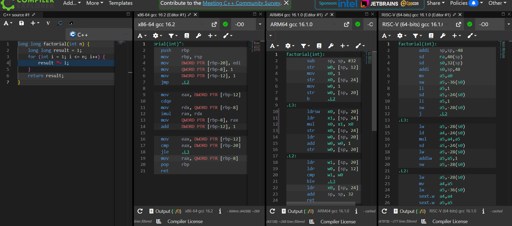
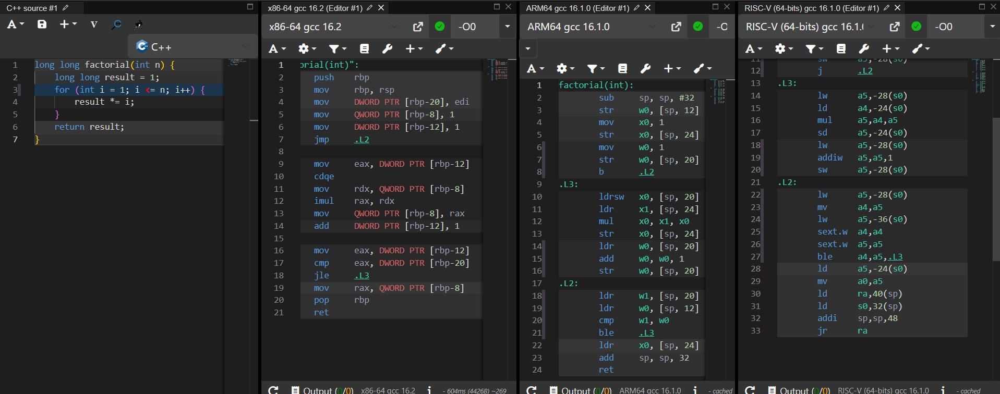

#  Самостійна робота №7:

**Тема:** Порівняння систем команд x86, ARM, RISC-V  
**Варіант №3:** Обчислення факторіала ітеративно  


##  Мета роботи
Навчитися читати асемблерний вивід компілятора для різних архітектур і показати на конкретному прикладі, які інженерні рішення відрізняють CISC-архітектуру (x86-64) від RISC-архітектур (ARM64, RISC-V).


##  Вихідний код мовою C

```c
long long factorial(int n) {
    long long result = 1;
    for (int i = 1; i <= n; i++) {
        result *= i;
    }
    return result;
}

```

##  Скомпільований код у Compiler Explorer




##  Аналіз та порівняння

### Таблиця 1. Архітектура — кількість інструкцій

| Архітектура | Кількість інструкцій |
| --- | --- |
| **x86-64** | **17** |
| **ARM64** | **20** |
| **RISC-V (64-bit)** | **24** |

### Таблиця 2. Передача аргументів та регістр результату

| Архітектура | Регістр(и) аргументів | Регістр результату |
| --- | --- | --- |
| **x86-64 (System V ABI)** | `edi` | `rax` |
| **ARM64 (AAPCS64)** | `w0` | `x0` |
| **RISC-V (RV64GC)** | `a0` | `a0` |


##  Висновок

У ході виконання самостійної роботи було скомпільовано функцію обчислення факторіала для трьох архітектур (без оптимізацій, `-O0`). Результати показують, що RISC-архітектури (ARM64 — 20 команд, RISC-V — 24 команди) потребують більше інструкцій, ніж CISC-архітектура x86-64 (17 команд).

Це пояснюється принципом **load/store**: у RISC-процесорах арифметичні операції (`mul`, `add`, `cmp`) виконуються **виключно над регістрами**. Через відсутність оптимізації компілятор змушений кожного разу явно завантажувати значення зі стека в регістри (командами `ldr`/`lw`) і зберігати результати назад у пам'ять (`str`/`sd`/`sw`). Натомість CISC-архітектура x86-64 дозволяє виконувати обчислення прямо над операндами в пам'яті (`imul rax, QWORD PTR [rbp-8]`), що скорочує загальну кількість інструкцій у коді.


##  Відповіді на контрольні запитання

1. **Чому в RISC-архітектурах арифметичні команди не можуть напряму звертатися до пам'яті?**
Це спрощує декодер і конвеєр процесора: усі команди мають однакову довжину і фіксований формат, що дозволяє виконувати їх передбачувано за 1 такт і підвищувати частоту процесора.
2. **Чи завжди більша кількість інструкцій в асемблерному коді означає повільніше виконання? Від чого це залежить?**
Ні, не завжди. Прості RISC-інструкції зазвичай виконуються за 1 такт, тоді як одна складна CISC-інструкція може вимагати багатьох тактів. Реальний час виконання залежить від частоти, конвеєризації (pipelining) та ефективності кеш-пам'яті.
3. **Наведіть приклад ситуації, коли складна CISC-команда x86 виконує роботу кількох RISC-команд.**
Команда `imul rax, QWORD PTR [rbp-8]` в x86 за один крок читає значення з пам'яті та виконує множення. У RISC-V для цього потрібні дві окремі команди: `ld a4, -24(s0)` (читання з пам'яті) та `mul a5, a4, a5` (множення).
